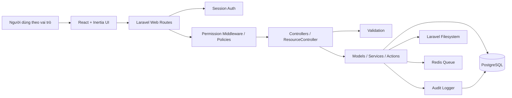

# Kiến trúc tổng thể hệ thống quản lý Trường THPT Võ Văn Kiệt

## 1. Mục tiêu kiến trúc

Hệ thống là cổng quản lý nội bộ cho Trường THPT Võ Văn Kiệt, phục vụ vận hành học vụ, điểm số, rèn luyện, phong trào, học phí, thông báo, báo cáo và cổng phụ huynh/học sinh. Kiến trúc ưu tiên:

- Dễ mở rộng theo module nghiệp vụ của trường THPT.
- Phân quyền chi tiết theo vai trò và phạm vi dữ liệu.
- Audit log bắt buộc cho thao tác nhạy cảm.
- Seed/test chỉ dùng dữ liệu giả.
- Chạy và triển khai được bằng Docker.

## 2. Stack hiện tại

- Backend: Laravel 13, PHP 8.3+, session auth, Eloquent ORM, migrations, seeders, PHPUnit.
- Frontend: React 19, TypeScript, Inertia, Vite, lucide-react.
- Database: PostgreSQL cho môi trường chính, SQLite có thể dùng cho test.
- Cache/queue/session mở rộng: Redis, queue worker trong Docker Compose.
- Runtime/devops: Dockerfile, Docker Compose, `.env.example`, `php artisan`, `npm`.

## 3. Luồng tổng thể



## 4. Frontend architecture

Frontend hiện dùng Inertia nên không tách API SPA độc lập ở V1. Laravel trả Inertia response, React render page tương ứng.

- Entry point: `resources/js/app.tsx`.
- Layout chính: `resources/js/Layouts/AuthenticatedLayout.tsx`.
- Trang nghiệp vụ hiện tại:
  - `Dashboard.tsx`
  - `Portal.tsx`
  - `Audit/Index.tsx`
  - `Reports/Index.tsx`
  - `Resource/Index.tsx`
  - `Auth/Login.tsx`
- Resource CRUD dùng chung nhận `definition`, `records`, `lookups`, `filters`, `can` từ backend.
- UI dùng tiếng Việt, bố cục quản trị với sidebar, bảng, modal form, phân trang, tìm kiếm.

Nguyên tắc mở rộng frontend:

- Page đặt trong `resources/js/Pages/{Module}` nếu có workflow riêng.
- Component dùng chung đặt trong `resources/js/Components`.
- Không tự quyết định quyền hoặc scope dữ liệu ở UI; UI chỉ ẩn/hiện theo `can`, server vẫn phải enforce.
- Form hiển thị lỗi validation từ Laravel.

## 5. Backend architecture

Backend là modular monolith Laravel. Các module dùng chung nền tảng auth, RBAC, audit và database transaction.

- Routes: `routes/web.php`.
- Auth: `AuthenticatedSessionController`.
- Dashboard/reports/portal/audit: controller riêng.
- CRUD cấu hình: `ResourceController`.
- Permission middleware: `EnsurePermission`.
- Inertia shared props/navigation: `HandleInertiaRequests`.
- Audit service: `App\Support\Audit\Auditor`.
- Models: `app/Models`.
- Resource registry: `config/school.php`.

Mẫu xử lý request:

1. User đăng nhập bằng session Laravel.
2. Route yêu cầu `auth`.
3. Controller lấy resource definition.
4. Server kiểm tra permission dạng `{module}.{resource}.{action}`.
5. Server validate input.
6. Với nghiệp vụ nhạy cảm, ghi audit/revision trong transaction.
7. Trả Inertia response hoặc redirect kèm flash message.

## 6. Database architecture

Database chính là PostgreSQL. Schema phải được quản lý bằng migration, không sửa trực tiếp database.

Nhóm bảng hiện tại:

- Identity/RBAC: `users`, `roles`, `permissions`, `role_permissions`, `user_roles`.
- Audit: `audit_logs`.
- Academic: `school_years`, `semesters`, `grades`, `classes`, `students`, `guardians`, `student_guardians`, `staff`, `teacher_profiles`, `class_enrollments`, `subjects`, `teaching_assignments`.
- Assessment: `score_categories`, `score_entries`, `score_revisions`.
- Conduct/discipline/rewards: `conduct_scores`, `conduct_revisions`, `disciplinary_cases`, `disciplinary_actions`, `commendations`, `commendation_recipients`.
- Activities/competitions: `school_events`, `event_registrations`, `event_results`.
- Finance: `fee_categories`, `fee_plans`, `fee_invoices`, `fee_invoice_items`, `payments`.
- Communication/storage metadata: `announcements`, `announcement_targets`, `announcement_reads`, `attachments`.

Module chưa có schema ở hiện trạng:

- Điểm danh/chuyên cần: cần bổ sung migration riêng cho buổi học, điểm danh, lý do vắng, xác nhận của GVCN/giám thị nếu triển khai Phase 3.

## 7. Storage architecture

Laravel Filesystem được dùng cho tệp đính kèm. Bảng `attachments` lưu metadata theo polymorphic relation.

Định hướng storage:

- Tệp nội bộ nhạy cảm lưu private disk.
- Tệp công khai như ảnh tin/thông báo có thể lưu public disk.
- Mọi upload cần validate mime type, dung lượng, quyền truy cập và subject liên kết.
- Không lưu dữ liệu học sinh thật hoặc tài liệu nhạy cảm trong seed/test.

## 8. Authentication

Hệ thống dùng Laravel session authentication.

- Không có public self-registration.
- Tài khoản do Admin hoặc vai trò được ủy quyền cấp.
- Một `user` có thể liên kết với `staff`, `student` hoặc `guardian`.
- Password phải hash bằng Laravel.
- Login/logout được audit ở mức hệ thống.

## 9. Authorization

Authorization dùng RBAC nhiều vai trò:

- Role và permission nằm trong database.
- Role matrix gốc nằm trong `config/school.php`.
- Permission key theo dạng `module.resource.action`.
- Admin có quyền `*`.
- BGH có quyền rộng và xem audit/report.
- Giáo viên bộ môn bị giới hạn theo `teaching_assignments`.
- Phụ huynh chỉ xem học sinh đã liên kết.
- Học sinh chỉ xem dữ liệu cá nhân.

Các thao tác nhạy cảm luôn cần audit:

- Sửa điểm số.
- Sửa điểm rèn luyện.
- Thu/hoàn học phí.
- Kỷ luật.
- Phân quyền.
- Liên kết tài khoản phụ huynh/học sinh.

## 10. Cross-cutting concerns

- Validation: mọi input phải validate phía server.
- Audit: dùng `Auditor::record()` cho thao tác nhạy cảm.
- Revision: bảng revision cho điểm số và điểm rèn luyện; mở rộng pattern này cho module nhạy cảm khác.
- Transaction: dùng transaction cho thao tác ghi nhiều bảng.
- Seed: chỉ dùng dữ liệu giả với mã demo và email `.test`/`.local`.
- Reports: tổng hợp dữ liệu từ các module, không bỏ qua scope quyền.
- Docker: app, vite, queue, postgres, redis tách service trong `docker-compose.yml`.

## 11. Cấu trúc thư mục đề xuất

Giữ cấu trúc hiện tại, mở rộng có kiểm soát:

```text
app/
  Actions/                  # Hành động nghiệp vụ phức tạp
  Http/
    Controllers/
    Middleware/
    Requests/               # FormRequest cho workflow riêng
  Models/
  Policies/                 # Policy theo model khi cần scope phức tạp
  Support/
    Audit/
config/
  school.php                # Resource registry, role matrix
database/
  migrations/
  seeders/
resources/
  js/
    Components/
    Layouts/
    Pages/
      Academic/
      Assessment/
      Attendance/
      Conduct/
      Finance/
      Portal/
      Reports/
  css/
routes/
  web.php
tests/
  Feature/
  Unit/
docs/
```

## 12. Nguyên tắc triển khai tiếp theo

- Tài liệu và migration phải đi trước thay đổi schema lớn.
- Khi thêm module mới, cập nhật `config/school.php`, model, migration, seed giả, quyền và test permission.
- Với workflow vượt quá CRUD đơn giản, tạo controller/page/action riêng thay vì nhồi toàn bộ vào `ResourceController`.
- Không commit `vendor`, `node_modules`, `.env`, log hoặc build artifact.

